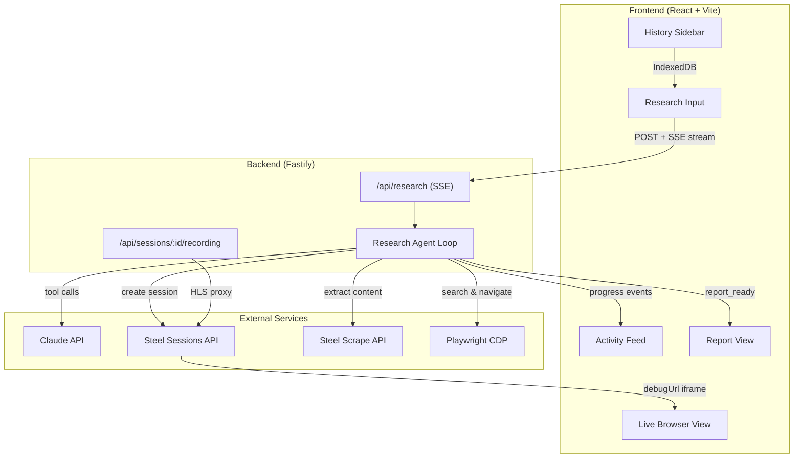
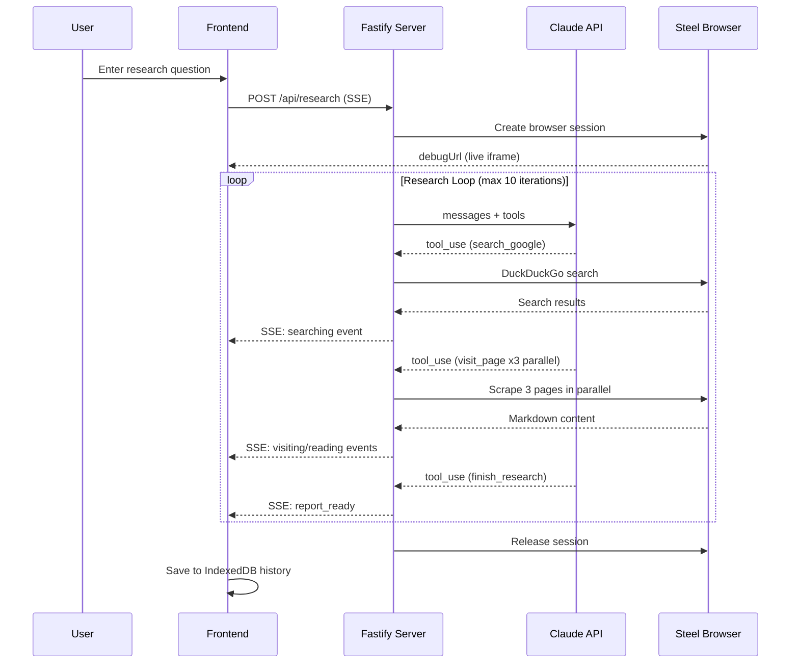

# Steel Research Agent

AI-powered deep web research using [Steel's](https://steel.dev) cloud browser infrastructure. Ask a question, watch an AI agent browse the web in real-time, and get a comprehensive research report with cited sources.


## Features

- **Live Browser View** -- Watch the AI agent navigate, search, and read web pages in real-time via Steel's session embedding
- **Claude-Powered Research** -- Uses Claude's tool-use API to autonomously decide what to search, which pages to read, and when to synthesize findings
- **Cited Reports** -- Every claim in the final report is backed by numbered source citations
- **Real-Time Activity Feed** -- See the agent's thought process and progress as it works
- **Research History** -- IndexedDB-backed sidebar to revisit past research sessions
- **Responsive Design** -- Fully responsive UI that works on desktop, tablet, and mobile

## Architecture





## Tech Stack

| Layer | Technology |
|-------|-----------|
| Frontend | React 19, Tailwind CSS v4, Vite 7 |
| Backend | Fastify 5, TypeScript 5.9 |
| AI | Claude Sonnet 4.6 (Anthropic SDK) |
| Browser | Steel SDK, Playwright (CDP) |
| Infrastructure | Docker |
| Realtime | Server-Sent Events (SSE) |
| Storage | IndexedDB (client-side history) |
| Streaming | HLS.js (session recording) |
| Markdown | react-markdown, remark-gfm |

## Steel Features Used

- **Sessions API** -- Create and manage cloud browser instances
- **Session Embedding** -- Live iframe view of the browser via `debugUrl`
- **Scrape API** -- Extract page content as clean markdown
- **Playwright Integration** -- Full browser control via CDP WebSocket

## Setup

### Local Development

```bash
# Clone and install
git clone https://github.com/Ray0907/steel-research-agent.git
cd steel-research-agent
pnpm install

# Configure API keys
cp .env.example .env
# Edit .env with your STEEL_API_KEY and ANTHROPIC_API_KEY

# Run development servers
pnpm dev
```

### Docker

```bash
# Configure API keys
cp .env.example .env

# Build and run
docker compose up --build
```

The app will be available at http://localhost:3001.

Get your Steel API key at [app.steel.dev](https://app.steel.dev/settings/api-keys).

## Usage

1. Open http://localhost:5173
2. Enter a research question
3. Watch the AI agent browse the web in the live browser panel
4. Follow the agent's progress in the activity feed
5. Read the final research report with citations
6. Access past research from the history sidebar

## CLI Testing

```bash
# Start the server
pnpm dev:server

# In another terminal
pnpm test:cli "What are the top browser automation frameworks for AI agents?"
```
